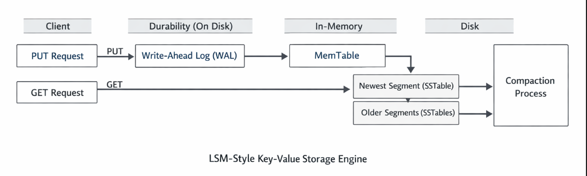
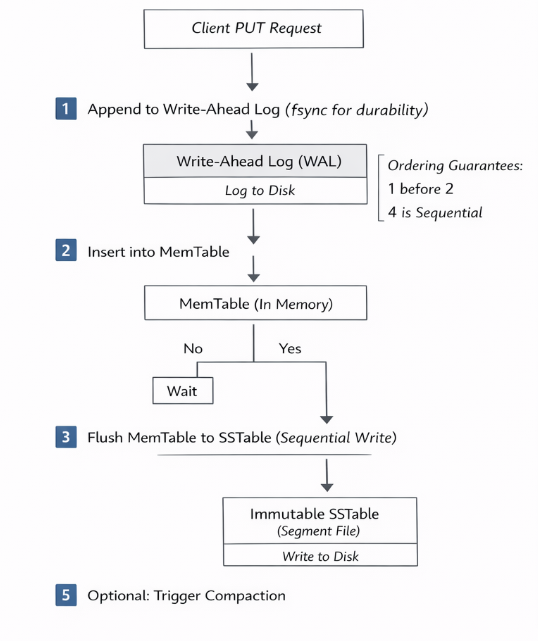
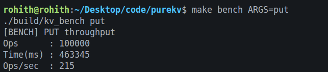
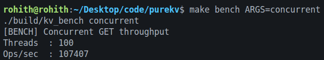

# **PureKV**

An LSM-style key-value storage engine implemented in C++, providing write-ahead logging for durability, crash recovery through log replay, immutable on-disk segment files, deterministic compaction, and thread-safe concurrent access.

🔗 [View Documentation](docs/index.md)

## **Architecture Overview**

PureKV is structured as a log-structured merge (LSM) style storage engine, where writes are first made durable, then served from memory, and eventually persisted to immutable on-disk files.
The design cleanly separates durability, in-memory performance, and disk persistence, while maintaining correctness under concurrency and crashes.

  

### High Level Data Flow

| **Write Data Flow**                                                                     | **Read Data Flow**                                                                    |
| --------------------------------------------------------------------------------------- | ------------------------------------------------------------------------------------- |
| **Client** - sends PUT(key, value)                                                      | **Client** - sends GET(key)                                                           |
| **Write-Ahead Log (Disk)** - append record for durability                               | **MemTable (Memory)** - check latest data                                             |
| **MemTable (Memory)** - store latest version                                            | **Newest SSTable (Disk)** - check recent segment                                      |
| **SSTable (Disk)** - MemTable flushed as immutable segment                              | **Older SSTables (Disk)** - check in order (new to old)                               |
| **Compaction** - merge segments, discard old data                                       | **Response** - return value or KEY_NOT_FOUND                                          |
| 
  
 | 
  
 |

## **Core Components**

### **Write-Ahead Log (WAL)**

- Ensures durability before in-memory updates
- Uses checksums to detect corruption
- Replayed during startup for crash recovery
- [ more info ](docs/04_write_ahead_log.md)

### **MemTable**

- In-memory key-value map
- Thread-safe using shared mutexes
- Flushed to disk when size threshold is reached
- [ more info ](docs/02_memtable.md)

### **Segment Files**

- Immutable on-disk files
- Sequential writes only
- Simplifies concurrency and recovery
- [ more info ](docs/03_data_segment.md)

### **Compaction**

- Merges multiple segments into one
- Resolves duplicate keys (last-write-wins)
- Safely deletes old segments
- [ more info ](docs/05_compaction.md)

## **Concurrency Model**

- WAL writes are serialized
- MemTable uses shared mutex for concurrent reads
- Segment metadata is protected independently
- Flush and compaction use snapshot-based isolation

## **Crash Recovery and Data Integrity**

- WAL is replayed on startup
- Recovery re-applies intent, not state
- Checksums detect corrupted WAL and segment records
- Engine fails safely on corruption

## **Testing**

The project includes:

- Concurrent read/write tests
- Crash simulation and recovery verification
- Segment corruption detection tests
- Separate benchmark binary to avoid test interference

## **Benchmarks**

Benchmarks are implemented as a separate binary.

Measured:

- PUT throughput
  
  

- GET throughput
  
  

- Concurrent GET scaling
  
  

