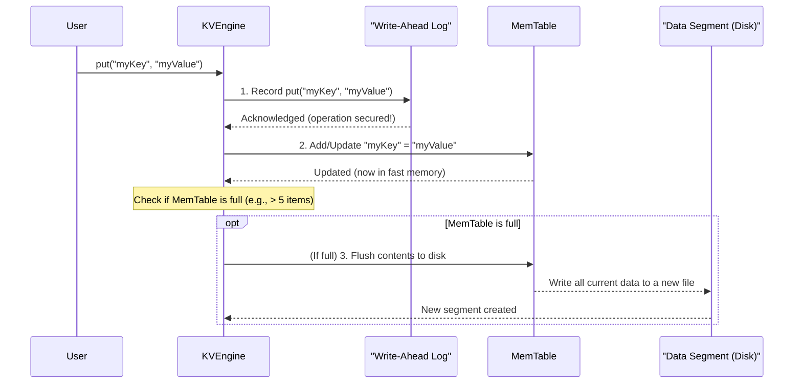

# Chapter 1: KV Engine

Imagine you're building a super-fast and reliable system that needs to remember simple pieces of information, like user settings, game scores, or product details. How would you store "username" and "Alice", or "score" and "1000"? You'd want to quickly save this information, get it back, and maybe even delete it later.

This is exactly the problem a **Key-Value (KV) Store** solves! It's like a dictionary or a phone book where you have unique **keys** (like "name" or "phone number") and associated **values** (like "Alice" or "123-456-7890").

The `purekv` project is a simple database that provides this kind of Key-Value storage. And at its heart is the **KV Engine**.

## What is the KV Engine?

Think of the KV Engine as the **head chef** in a busy restaurant.

- **Customers (users)** give their orders (`put`, `get`, `del`) to the head chef.
- The **head chef (KV Engine)** doesn't cook everything themselves. Instead, they direct different parts of the kitchen staff to prepare the dish, manage ingredients, and ensure everything is served correctly and on time.

In `purekv`, the KV Engine is the central brain that users talk to. It's responsible for managing all the data operations:

- **`put(key, value)`**: To store a new key-value pair or update an existing one.
- **`get(key)`**: To retrieve the value associated with a key.
- **`del(key)`**: To remove a key-value pair.

It coordinates several internal components to make sure your data is stored efficiently, reliably, and can be retrieved quickly. These components are like the specialized kitchen staff, and we'll learn about them in detail in later chapters:

- **[Write-Ahead Log (WAL)](04_write_ahead_log.md)**: The "order notepad" to ensure no orders are ever lost, even if the kitchen has a sudden power outage.
- **[MemTable](02_memtable.md)**: The "fast-prep station" where new or frequently accessed items are kept for quick access. It's all in memory!
- **[Data Segment (SSTable)](03_data_segment.md)**: The "pantry shelves" where finished dishes are neatly stored on disk for long-term keeping.

## How to use the KV Engine

Let's see how you'd interact with the KV Engine as a user. It's quite straightforward, just like placing an order with the head chef!

Here's a simple C++ example of creating an engine, putting data into it, getting data back, and deleting it:

```cpp
#include "kv_engine.h"
#include <iostream> // For printing output

int main() {
    // 1. Create our database engine!
    KVEngine* myEngine = CreateKVEngine();
    std::cout << "KV Engine created.\n";

    // 2. Put some data: store "world" with key "hello"
    Status putStatus = myEngine->put("hello", "world");
    if (putStatus.ok()) {
        std::cout << "Successfully put 'hello' = 'world'.\n";
    }

    // 3. Get data back: retrieve value for key "hello"
    std::string retrievedValue;
    Status getStatus = myEngine->get("hello", &retrievedValue);
    if (getStatus.ok()) {
        std::cout << "Retrieved 'hello' = '" << retrievedValue << "'.\n";
    } else {
        std::cout << "Failed to get 'hello'.\n";
    }

    // 4. Delete data: remove the key "hello"
    Status delStatus = myEngine->del("hello");
    if (delStatus.ok()) {
        std::cout << "Successfully deleted 'hello'.\n";
    }

    // 5. Try to get it again (this should now fail)
    getStatus = myEngine->get("hello", &retrievedValue);
    if (!getStatus.ok()) {
        std::cout << "Attempt to get deleted 'hello' failed as expected.\n";
    }

    // It's important to clean up the engine when done!
    delete myEngine;
    std::cout << "KV Engine cleaned up.\n";
    return 0;
}
```

**What happens when you run this code?**

1.  `CreateKVEngine()` brings our database to life.
2.  `myEngine->put("hello", "world")` saves the pair. You'll see a success message.
3.  `myEngine->get("hello", &retrievedValue)` fetches "world" back, and it's printed.
4.  `myEngine->del("hello")` removes the entry. Another success message.
5.  Trying to `get("hello")` again will now tell you the key is "NOT_FOUND", because it was deleted.
6.  `delete myEngine;` gracefully shuts down the database, ensuring all operations are finalized.

## Inside the KV Engine: How it Works

The KV Engine's primary job is to coordinate all operations. Let's trace what happens when you call `put`, `get`, or `del`.

### The `put` Operation (Storing Data)

When you `put("myKey", "myValue")`, the KV Engine (our head chef) performs a sequence of steps to ensure the data is stored both safely and quickly:

1.  **Record in the [Write-Ahead Log](04_write_ahead_log.md)**: First, the KV Engine writes the operation (`put myKey myValue`) into a special log file on disk. This is like the head chef writing down your order on a permanent notepad _before_ giving it to the cooks. If something goes wrong (like a power outage) right after this step, we can always reconstruct our data from this log. This ensures **durability**.
2.  **Update the [MemTable](02_memtable.md)**: Next, the KV Engine updates its fast, in-memory store (the MemTable). This is like adding the dish to the fast-prep station. New data is immediately available for super-quick `get` requests. This ensures **speed for recent data**.
3.  **Check for Flush**: If the [MemTable](02_memtable.md) (the fast-prep station) gets too full, the KV Engine will take all its contents and "flush" them to a new [Data Segment](03_data_segment.md) file on disk. This frees up memory for new data and persists older data more permanently.

Here's a simple diagram illustrating the `put` process:



### The `get` Operation (Retrieving Data)

When you `get("myKey")`, the KV Engine prioritizes speed:

1.  **Check [MemTable](02_memtable.md)**: It first looks for the key in the super-fast in-memory [MemTable](02_memtable.md) (the fast-prep station). Since this is in RAM, it's incredibly quick.
2.  **Check [Data Segments](03_data_segment.md)**: If the key isn't in the [MemTable](02_memtable.md), the KV Engine then looks through the [Data Segment](03_data_segment.md) files on disk (the pantry shelves). It checks the newest segments first, moving backwards, because newer segments contain more up-to-date information.

### The `del` Operation (Deleting Data)

Deleting a key is similar to `put`:

1.  **Record in [Write-Ahead Log](04_write_ahead_log.md)**: The deletion (`del myKey`) is first recorded in the [Write-Ahead Log](04_write_ahead_log.md) for durability.
2.  **Remove from [MemTable](02_memtable.md)**: The key is immediately removed from the in-memory [MemTable](02_memtable.md).
3.  **Disk handling**: For keys present in older [Data Segment](03_data_segment.md) files, the deletion is implicitly handled by a process called [Compaction](05_compaction.md), which cleans up old data and removes "deleted" entries later on.

## KV Engine Code Walkthrough

Let's peek at some simplified code from `src/kv_engine.cpp` to see these ideas in action.

### Starting Up (Recovery)

When the `KVEngineImpl` is created, it first checks the [Write-Ahead Log](04_write_ahead_log.md) to see if there were any unfinished operations before a potential crash. This is vital for recovery!

```cpp
// From src/kv_engine.cpp
class KVEngineImpl : public KVEngine {
    private:
        // 'store_' is our in-memory data store, aka MemTable
        std::unordered_map<std::string, std::string> store_;
        // 'wal_' is a pointer to our Write-Ahead Log
        WAL* wal_;
        // ... other internal components ...

    public:
        // Constructor: called when KVEngine starts
        KVEngineImpl() :wal_(CreateWAL("wal/kv.wal")){
            // Replay the WAL: Read all operations from the log
            // and apply them to our in-memory store.
            // This recovers our database state after a restart!
            wal_->replay(
                [this](WalOpType type, const std::string &key, const std::string &value){
                    if(type==WalOpType::PUT){
                        store_[key]=value; // Re-add data to MemTable
                    } else if(type==WalOpType::DEL){
                        store_.erase(key); // Re-delete data from MemTable
                    }
                }
            );
        }
        // ... rest of the class ...
};
```

This snippet shows how the KV Engine uses the [Write-Ahead Log](04_write_ahead_log.md) during startup to "replay" all recorded operations and restore its in-memory state. This guarantees that your data is safe even if the system crashed.

### The `put` Method

The `put` method clearly shows the two-step process: log first, then memory.

```cpp
// From src/kv_engine.cpp
Status put(const std::string & key,const std::string & value) override{
    // 1. Write to the Write-Ahead Log (WAL) first.
    //    This makes the operation durable.
    wal_->appendPut(key, value); // Link: [Write-Ahead Log](04_write_ahead_log.md)

    // 2. Update the in-memory store (MemTable).
    //    This makes the data immediately available for fast reads.
    store_[key]=value; // Link: [MemTable](02_memtable.md)

    // 3. Check if the in-memory store is too full.
    //    If it is, we need to save its contents to a disk file.
    if (store_.size() >= mem_limit) { // 'mem_limit' is set to 5 in the code.
        flush_memtable(); // This function writes data to a [Data Segment](03_data_segment.md)
    }

    return Status::OK();
}
```

Notice how the `wal_` (Write-Ahead Log) is updated _before_ `store_` (MemTable). This order is critical for data safety. The `flush_memtable()` call (which we'll explore more in the [MemTable](02_memtable.md) chapter) is how data moves from fast memory to slower but permanent disk storage.

### The `get` Method

The `get` method demonstrates the lookup strategy: check fast memory first, then disk.

```cpp
// From src/kv_engine.cpp
Status get(const std::string & key, std::string* value) override{
    // 1. Try to find the key in the in-memory store (MemTable).
    auto it = store_.find(key);
    if (it != store_.end()) {
        *value = it->second;
        return Status::OK(); // Found it fast!
    }

    // 2. If not in memory, search through the Data Segments on disk.
    //    We iterate from the newest segments backwards, because newer segments
    //    contain the most up-to-date values for keys.
    for (auto it = segments_.rbegin(); it != segments_.rend(); ++it) {
        // 'read_from_segment' tries to find the key in one disk file.
        if (read_from_segment(*it, key, value)) { // Link: [Data Segment](03_data_segment.md)
            return Status::OK(); // Found it on disk!
        }
    }

    // If we've checked everywhere and still haven't found it:
    return Status::Error("KEY_NOT_FOUND");
}
```

This code shows the lookup priority: first the `store_` (our [MemTable](02_memtable.md) for recent data), and only then the `segments_` (our [Data Segment](03_data_segment.md) files on disk). This ensures `get` operations are as fast as possible.

### The `del` Method

The `del` method also follows the "log first, then memory" pattern.

```cpp
// From src/kv_engine.cpp
Status del(const std::string & key) override{
    // 1. Record the deletion in the Write-Ahead Log (WAL) for safety.
    wal_->appendDel(key); // Link: [Write-Ahead Log](04_write_ahead_log.md)

    // 2. Remove the key from the in-memory store (MemTable).
    auto it = store_.find(key);
    if (it == store_.end()) {
        return Status::Error("KEY_NOT_FOUND"); // Key wasn't in memory
    }
    store_.erase(key);

    return Status::OK();
}
```

Just like `put`, the deletion is first written to the `wal_` to ensure it's durable, and then applied to the in-memory `store_`.

## Conclusion

The KV Engine is truly the maestro of our `purekv` database. It provides the simple `put`, `get`, and `del` interface to users, and behind the scenes, it skillfully coordinates the [Write-Ahead Log](04_write_ahead_log.md), [MemTable](02_memtable.md), and [Data Segments](03_data_segment.md) to offer both speed and reliability.

You've now seen how the KV Engine acts as the central brain and learned the basic flow of operations. In the next chapter, we'll dive deeper into one of its key components: the [MemTable](02_memtable.md), our fast in-memory storage!

[Next Chapter: MemTable](02_memtable.md)
