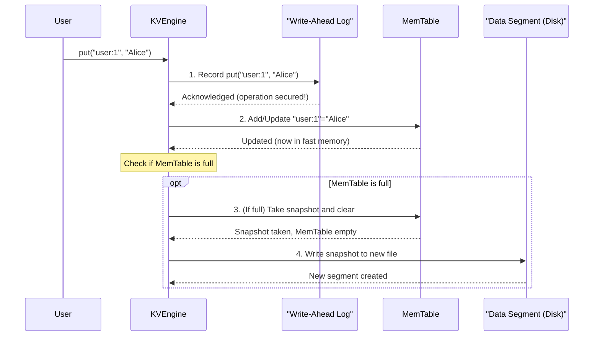

# Chapter 2: MemTable

In the previous chapter, we met the **KV Engine**, the central brain of `purekv`, which handles `put`, `get`, and `del` operations. We learned that the KV Engine doesn't do everything itself; instead, it coordinates several specialized components. One of the most important components for making operations super fast is the **MemTable**.

## The Need for Speed: Why a MemTable?

Imagine you're trying to quickly jot down new ideas during a brainstorming session. Would you write every single thought directly into a thick, leather-bound archive book, carefully finding the right page, and using permanent ink? Probably not! You'd grab a **whiteboard** or a scratchpad.

This is exactly the problem the **MemTable** solves in `purekv`. Disk drives, even fast SSDs, are much slower than your computer's main memory (RAM). If every single `put` or `get` operation had to wait for disk access, our database would feel sluggish.

The MemTable is like that fast, temporary whiteboard. It's a special place in memory where `purekv` can quickly store and retrieve the most **recent** key-value pairs.

## What is a MemTable?

The MemTable is:

- **In-Memory**: It lives in your computer's RAM, not on the disk. This is why it's incredibly fast.
- **Temporary**: It holds data only for a short period. Once it gets full, its contents are moved to permanent storage on disk.
- **For Recent Data**: All new `put` and `del` operations first change the MemTable. This means the freshest data is always here, ready for instant access.
- **Implemented as an `unordered_map`**: In `purekv`, the MemTable uses a C++ `unordered_map` (which is similar to a hash table). This data structure allows for very fast lookups, insertions, and deletions.

Think of it as the "fast-prep station" from our restaurant analogy in Chapter 1. New orders (data) are quickly processed and held there before being moved to the long-term pantry shelves.

## How the MemTable Works in `purekv`

Let's revisit the `put` and `get` operations, specifically focusing on the MemTable's role.

### Storing Data (`put` Operations)

When you call `put(key, value)`:

1.  **Safety First**: The KV Engine first records the operation in the [Write-Ahead Log (WAL)](04_write_ahead_log.md) on disk. This is crucial for durability – if the system crashes, we can recover.
2.  **Update MemTable**: Immediately after logging, the KV Engine updates the MemTable with the new key-value pair. Because the MemTable is in memory, this step is extremely fast.
3.  **Check Size and Flush**: The KV Engine keeps an eye on the MemTable's size. If it grows too large (reaches a `mem_limit`), its contents are "flushed." This means:
    - All current key-value pairs in the MemTable are written to a new, immutable [Data Segment](03_data_segment.md) file on disk.
    - The MemTable is then cleared, ready to start collecting new data.

Here's a simplified view of the `put` process with the MemTable:



### Retrieving Data (`get` Operations)

When you call `get(key)`:

1.  **Fast Lane First**: The KV Engine always checks the MemTable first. Since it's in RAM, this lookup is lightning-fast.
2.  **Disk Backup**: If the key isn't found in the MemTable (because it's older data that has already been flushed), the KV Engine then looks through the [Data Segment](03_data_segment.md) files on disk.

This two-step process ensures that recently added or updated data is retrieved instantly, while older data is still available from disk.

### Deleting Data (`del` Operations)

When you call `del(key)`:

1.  **Log It**: The deletion operation is first recorded in the [Write-Ahead Log (WAL)](04_write_ahead_log.md) for durability.
2.  **Remove from MemTable**: The key-value pair is immediately removed from the MemTable.

## MemTable in `purekv` Code

Let's look at the `KVEngineImpl` code from `src/kv_engine.cpp` to see how the MemTable is implemented and used. The MemTable itself is simply `store_`, an `unordered_map`.

### MemTable Declaration

```cpp
// From src/kv_engine.cpp
class KVEngineImpl : public KVEngine {
    private:
        // This is our MemTable! An unordered_map for fast in-memory access.
        unordered_map<string, string> store_;
        // ... other internal components ...
        size_t mem_limit = 5; // The maximum number of items before flushing
        // ...
};
```

Here, `store_` is the `unordered_map` that serves as our MemTable. `mem_limit` defines how many key-value pairs the MemTable can hold before it gets flushed. In this simple example, it's set to a very small number (5) for demonstration purposes.

### `put` and the MemTable

```cpp
// From src/kv_engine.cpp
Status put(const string & key,const string & value) override{
    // ... (WAL append code omitted for brevity, but it happens first!) ...

    // 1. Add/Update the key-value pair in the MemTable.
    //    'mem_mu_' is a mutex for safe concurrent access to the MemTable.
    {
        unique_lock<shared_mutex>mlock(mem_mu_);
        store_[key]=value; // This is the actual MemTable update!
    }

    // 2. Check if the MemTable is full and needs to be flushed.
    bool flush_needed=false;
    {
        shared_lock<shared_mutex> rlock(mem_mu_);
        if(store_.size()>=mem_limit){ // If current size meets the limit
            flush_needed=true;
        }
    }

    if(flush_needed){
        flush_memtable(); // Call the flush function
    }

    return Status::OK();
}
```

This snippet clearly shows how `store_[key]=value;` updates the in-memory MemTable. Then, it checks `store_.size()` against `mem_limit` to decide if `flush_memtable()` should be called.

### `get` and the MemTable

```cpp
// From src/kv_engine.cpp
Status get(const string & key, string* value) override{
    // 1. Try to find the key in the fast in-memory MemTable first.
    {
        shared_lock<shared_mutex> rlock(mem_mu_);
        auto it=store_.find(key);
        if(it!=store_.end()){ // If found in MemTable
            *value=it->second;
            return Status::OK(); // Return immediately, very fast!
        }
    }
    // 2. If not found in MemTable, then search the Data Segments on disk.
    // ... (Disk search code omitted, covered in Chapter 3: Data Segment) ...

    return Status::Error("KEY_NOT_FOUND");
}
```

The `get` method prioritizes the MemTable lookup using `store_.find(key)`. Only if the key isn't found here does it proceed to check the slower disk storage.

### `del` and the MemTable

```cpp
// From src/kv_engine.cpp
Status del(const string & key) override{
    // ... (WAL append code omitted, but it happens first!) ...

    // 1. Remove the key from the in-memory MemTable.
    {
        unique_lock<shared_mutex>lock(mem_mu_);
        auto it=store_.find(key);
        if(it==store_.end()){
            return Status::Error("KEY_NOT_FOUND"); // Key wasn't in MemTable
        }
        store_.erase(key); // This removes the entry from MemTable!
    }

    return Status::OK();
}
```

Similar to `put`, `del` also directly modifies the MemTable (`store_.erase(key)`), ensuring that deleted items are no longer present for future `get` requests from memory.

### Flushing the MemTable (`flush_memtable` function)

When the MemTable reaches its `mem_limit`, the `flush_memtable` function is called.

```cpp
// From src/kv_engine.cpp
void flush_memtable(){
    // 1. Take a snapshot of the current MemTable contents and clear it.
    unordered_map<string,string>snapshot;
    {
        unique_lock<shared_mutex>lock(mem_mu_);
        snapshot.swap(store_); // Moves all MemTable data to 'snapshot' and clears 'store_'
    }

    // 2. Create a unique name for the new Data Segment file.
    ostringstream name;
    name << "segments/seg_"<<segments_.size()<<".sst"; // e.g., "segments/seg_0.sst"

    // 3. Write the snapshot data to the new Data Segment file on disk.
    write_segment(name.str(), snapshot); // We'll learn about write_segment in Chapter 3!

    // 4. Record the new segment file so the KV Engine knows about it.
    {
        lock_guard<mutex> lock(seg_mu_);
        segments_.push_back(name.str());
    }

    // ... (Compaction check code omitted for brevity) ...
}
```

The most important part here is `snapshot.swap(store_);`. This efficiently moves all data from `store_` (our MemTable) into a temporary `snapshot` variable, and at the same time, clears `store_`, making it ready for new incoming data. The `snapshot` is then written to a permanent [Data Segment](03_data_segment.md) file on disk.

## Key Characteristics of MemTable

| Feature       | Description                                                 | Impact                                               |
| :------------ | :---------------------------------------------------------- | :--------------------------------------------------- |
| **In-Memory** | Stores data in RAM.                                         | **Extremely Fast** `put`, `get`, `del` operations.   |
| **Volatile**  | Data is lost if the system crashes before flushing.         | Relies on [WAL](04_write_ahead_log.md) for recovery. |
| **Mutable**   | Key-value pairs can be added, updated, or deleted directly. | Provides a dynamic view of the latest data.          |
| **Temporary** | Cleared after being flushed to disk.                        | Efficiently manages RAM usage.                       |

## Conclusion

The MemTable is a cornerstone of `purekv`'s performance. By providing a super-fast, in-memory buffer for recent data, it ensures that `put`, `get`, and `del` operations are handled with minimal delay. It works hand-in-hand with the [Write-Ahead Log (WAL)](04_write_ahead_log.md) for durability and constantly prepares data to be moved to the more permanent [Data Segment](03_data_segment.md) files on disk.

Now that we understand how new data is quickly handled in memory, let's explore where this data goes for long-term storage: the [Data Segment](03_data_segment.md) files.

[Next Chapter: Data Segment (SSTable)](03_data_segment.md)
