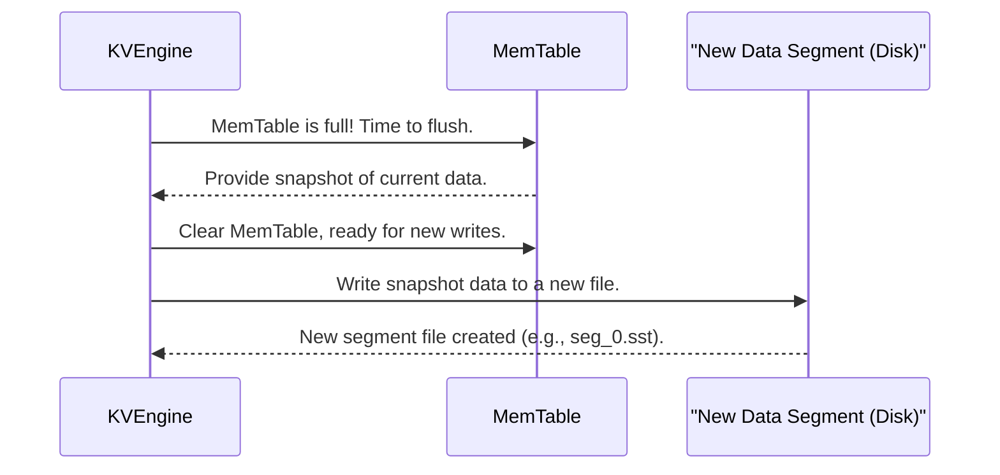

# Chapter 3: Data Segment (SSTable)

In the [previous chapter](02_memtable.md), we learned about the **MemTable**, an incredibly fast in-memory storage for the most recent key-value pairs. The MemTable is great for speed, but it has two main limitations:

1.  **Limited Size**: RAM is finite. We can't keep _all_ our data in the MemTable forever.
2.  **Volatile**: If the computer loses power, all data in the MemTable is gone (unless recorded in the [Write-Ahead Log (WAL)](04_write_ahead_log.md)). We need a way to store data permanently.

This is where **Data Segments** come in! They are `purekv`'s way of storing data reliably and persistently on disk, ensuring your information isn't lost and can grow beyond the limits of your computer's memory.

## What is a Data Segment (SSTable)?

A Data Segment is a special type of file on disk that `purekv` uses for long-term storage. It's often called an **SSTable**, which stands for **Sorted String Table**.

Think of a Data Segment like a **published page in a physical dictionary or encyclopedia**:

- **It's permanent (on disk)**: Once a page is printed, it's bound into the book. Similarly, a Data Segment is written to your hard drive.
- **It's immutable (cannot be changed)**: You can't erase or rewrite a printed page in a dictionary. If there's a new definition or an update, it goes into a _new_ edition or a later section of the book. Data Segments work the same way: once a Data Segment file is written, its contents are **fixed** and **cannot be altered**.
- **It stores sorted data**: The words in a dictionary are always sorted alphabetically. Data Segments also store their key-value pairs in a sorted order. This sorting is incredibly useful for finding data quickly.

Each time the [MemTable](02_memtable.md) gets full, `purekv` takes all the data from it and writes it into a _new_, separate Data Segment file on disk.

## How Data Segments Work in `purekv`

Data Segments are essential for both storing data permanently and retrieving it efficiently.

### Writing Data (The "Flush" Process)

When the [MemTable](02_memtable.md) reaches its size limit (e.g., after 5 key-value pairs in `purekv`'s simple implementation), `purekv` performs a "flush" operation:

1.  **Snapshot the MemTable**: All the current data in the [MemTable](02_memtable.md) is quickly copied into a temporary "snapshot."
2.  **Clear MemTable**: The [MemTable](02_memtable.md) is then cleared, making it ready to accept new incoming `put` and `del` operations.
3.  **Write to New Data Segment**: The data from the snapshot is written to a brand-new Data Segment file on disk. This file contains all the key-value pairs, sorted by key.

Here's a simplified sequence of flushing the MemTable to a Data Segment:



### Reading Data

When you call `get(key)`:

1.  **Check MemTable First**: As we learned, `purekv` first tries to find the key in the fast, in-memory [MemTable](02_memtable.md).
2.  **Scan Data Segments**: If the key is _not_ found in the [MemTable](02_memtable.md), `purekv` then starts searching through the Data Segment files on disk.
    - **Newest First**: It always checks the most recently created Data Segments first, and then moves backward to older ones. Why? Because the newest segment will contain the most up-to-date value for a key, or a record that the key was deleted.

### Handling Updates and Deletions

Because Data Segments are immutable, updates and deletions are handled differently than in a traditional database that modifies files in place:

- **Updates**: If you `put("user:1", "Bob")` after you previously `put("user:1", "Alice")`, "Alice" might still be in an older Data Segment. But the _new_ value "Bob" will appear in the [MemTable](02_memtable.md) and eventually in a _newer_ Data Segment. When `get("user:1")` is called, it will find "Bob" in the newer segment (or MemTable) first, effectively overriding the old value.
- **Deletions**: When you `del("user:1")`, a special "deletion marker" is placed in the [MemTable](02_memtable.md) and eventually in a _newer_ Data Segment. If `get("user:1")` encounters this deletion marker in a newer segment, it knows the key is effectively deleted, even if it still exists in an older segment.

Over time, this can lead to multiple copies of a key or many deletion markers. A process called [Compaction](05_compaction.md) (which we'll cover later) cleans up these old, redundant entries, ensuring disk space is used efficiently.

## Data Segment Structure and Code in `purekv`

Let's look at how Data Segments are structured and managed in `purekv`.

### Inside a Data Segment File

Each Data Segment file on disk stores a sequence of key-value records. Each record has a simple format:

```
| uint32 crc      | (Checksum for integrity)
| uint32 key_len  | (Length of the key in bytes)
| uint32 val_len  | (Length of the value in bytes)
| key bytes       | (The actual key data)
| value bytes     | (The actual value data)
```

The `crc` (Cyclic Redundancy Check) is like a fingerprint for the key-value data. When `purekv` reads data, it recalculates the CRC and compares it to the stored `crc` to ensure the data hasn't been corrupted.

### Writing a Data Segment (`write_segment` function)

The `write_segment` function in `src/segment.cpp` is responsible for taking a snapshot of data (typically from a flushed [MemTable](02_memtable.md)) and writing it to a new Data Segment file.

```cpp
// From src/segment.cpp
Status write_segment(const string &path, const unordered_map<string, string> &data){
    int fd=open (path.c_str(),O_WRONLY|O_CREAT|O_TRUNC,0644); // Open a new file
    if(fd<0) return Status::Error("SEGMENT_OPEN_FAILED");

    for(const auto&[key,value]:data){ // Loop through all key-value pairs
        uint32_t klen=key.size();
        uint32_t vlen=value.size();

        // Prepare a buffer with klen, vlen, key, and value bytes
        vector<char>buf(sizeof(klen)+sizeof(vlen)+klen+vlen);
        size_t off=0;
        memcpy(buf.data()+off,&klen,sizeof(klen));off+=sizeof(klen);
        memcpy(buf.data()+off,&vlen,sizeof(vlen));off+=sizeof(vlen);
        memcpy(buf.data()+off,key.data(),klen);off+=klen;
        memcpy(buf.data()+off,value.data(),vlen);

        // Calculate a checksum (CRC) for the data
        uint32_t crc=crc32(0, reinterpret_cast<const Bytef*>(buf.data()), buf.size());

        // Write the CRC first, then the data (lengths, key, value) to the file
        if(write(fd,&crc,sizeof(crc))!=sizeof(crc) ||
           write(fd,buf.data(),buf.size())!= (ssize_t)(buf.size())){
            close(fd); return Status::Error("SEGMENT_WRITE_FAILED");
        }
    }
    fsync(fd); // Ensure data is truly written to disk
    close(fd); // Close the file
    return Status::OK();
}
```

This code iterates through all the key-value pairs provided, calculates their lengths and a checksum, then writes them sequentially into the new `.sst` file.

### Reading from a Single Data Segment (`read_from_segment` function)

The `read_from_segment` function (defined as a `static` helper method inside `KVEngineImpl` in `src/kv_engine.cpp`) is used to search for a specific key within a single Data Segment file.

```cpp
// From src/kv_engine.cpp (inside KVEngineImpl class)
static bool read_from_segment(const string & path, const string & key, string* value){
    int fd=open(path.c_str(),O_RDONLY); // Open the segment file
    if(fd<0) return false;

    while(true){ // Loop through records in the segment
        uint32_t stored_crc;
        if(read(fd, &stored_crc, sizeof(stored_crc)) != sizeof(stored_crc)) break; // Read CRC

        uint32_t klen,vlen;
        if(read(fd,&klen,sizeof(klen))!=sizeof(klen))break; // Read key length
        if(read(fd,&vlen,sizeof(vlen))!=sizeof(vlen))break; // Read value length

        // Prepare buffer to read the key and value bytes, including klen/vlen for CRC calc
        vector<char>buf(sizeof(klen)+sizeof(vlen)+klen+vlen);
        size_t off=0;
        memcpy(buf.data()+off,&klen,sizeof(klen));off+=sizeof(klen);
        memcpy(buf.data()+off,&vlen,sizeof(vlen));off+=sizeof(vlen);
        if(read(fd,buf.data()+off,klen+vlen)!=(ssize_t)(klen+vlen))break; // Read key + value

        // Calculate CRC for the read data and compare with stored CRC
        uint32_t calc_crc=crc32(0, reinterpret_cast<const Bytef*>(buf.data()), buf.size());
        if(calc_crc!=stored_crc) break; // If CRC doesn't match, data is corrupted or end of file

        // Extract the key and value strings from the buffer
        string k(buf.data() + sizeof(klen) + sizeof(vlen), klen);
        string v(buf.data() + sizeof(klen) + sizeof(vlen) + klen, vlen);

        if(k==key){ // Is this the key we are looking for?
            *value=v;
            close(fd);
            return true; // Found the key in this segment!
        }
    }
    close(fd);
    return false; // Key not found in this segment
}
```

This function reads record by record, checking CRCs and comparing keys until it finds a match or reaches the end of the file.

### The `flush_memtable` function (Connecting MemTable to Data Segments)

As mentioned, when the [MemTable](02_memtable.md) is full, `flush_memtable()` is called in `src/kv_engine.cpp`. This function uses `write_segment` to create new Data Segments.

```cpp
// From src/kv_engine.cpp
void flush_memtable(){
    unordered_map<string,string>snapshot;
    {
        unique_lock<shared_mutex>lock(mem_mu_);
        snapshot.swap(store_); // Atomically move MemTable contents to snapshot and clear MemTable
    }

    ostringstream name;
    // Create a unique name for the new segment file, e.g., "segments/seg_0.sst"
    name << "segments/seg_"<<segments_.size()<<".sst";

    // Call the write_segment function to write the snapshot to disk
    write_segment(name.str(), snapshot); // Uses the function from segment.cpp

    {
        lock_guard<mutex> lock(seg_mu_);
        segments_.push_back(name.str()); // Add the new segment's name to our list
    }

    // ... (logic for compaction check, covered in Chapter 5) ...
}
```

After the data is written, the `segments_` vector (a list of all Data Segment file names) is updated to include the new segment. This way, the KV Engine knows which files to search when a `get` request comes in.

### The `get` Method (Searching Data Segments)

Finally, let's revisit the `get` method from `src/kv_engine.cpp` to see how it uses the `segments_` list and `read_from_segment`.

```cpp
// From src/kv_engine.cpp (inside KVEngineImpl::get)
Status get(const string & key, string* value) override{
    // 1. First, try to find the key in the in-memory MemTable (for speed).
    {
        shared_lock<shared_mutex> rlock(mem_mu_);
        auto it=store_.find(key);
        if(it!=store_.end()){
            *value=it->second;
            return Status::OK();
        }
    }
    // 2. If not in MemTable, search through the Data Segments on disk.
    {
        lock_guard<mutex>slock(seg_mu_); // Protects our list of segment files
        // Iterate from the newest segment to the oldest (segments_ is a vector, rbegin() is reverse iterator for newest)
        for(auto it=segments_.rbegin();it!=segments_.rend();++it){
            // For each segment, try to read the key from it
            if(read_from_segment(*it,key,value)) return Status::OK(); // Found it!
        }
    }
    // If we've checked everywhere and still haven't found it:
    return Status::Error("KEY_NOT_FOUND");
}
```

This demonstrates the importance of the `segments_` list and the `read_from_segment` function for retrieving older data. The reverse iteration (`segments_.rbegin()`) is key to ensuring `purekv` always finds the most recent version of a key first.

## Key Characteristics of Data Segments

| Feature           | Description                                        | Impact                                                                          |
| :---------------- | :------------------------------------------------- | :------------------------------------------------------------------------------ |
| **Disk-Based**    | Stored on your hard drive (or SSD).                | **Persistent**: Data is saved even if the system loses power.                   |
| **Immutable**     | Once written, the file cannot be changed.          | **Simpler concurrency**: No need to lock parts of a file. Easier recovery.      |
| **Sorted**        | Key-value pairs are stored in sorted order by key. | **Efficient reads**: Can quickly find keys or ranges within a segment.          |
| **Appended Only** | New data always goes into _new_ segment files.     | Simplifies writes; old data is kept, managed by [Compaction](05_compaction.md). |

## Conclusion

Data Segments, or SSTables, are the backbone of `purekv`'s persistent storage. By taking data from the fast but temporary [MemTable](02_memtable.md) and writing it to immutable, sorted files on disk, `purekv` ensures that your data is safe, durable, and can scale. While their immutability simplifies many aspects, it also introduces the need for a mechanism to clean up old, redundant data, which we'll explore in the chapter on [Compaction](05_compaction.md).

Before we get to cleaning up, let's ensure our operations are always safe, even in the face of unexpected crashes, by learning about the [Write-Ahead Log (WAL)](04_write_ahead_log.md).

[Next Chapter: Write-Ahead Log (WAL)](04_write_ahead_log.md)
