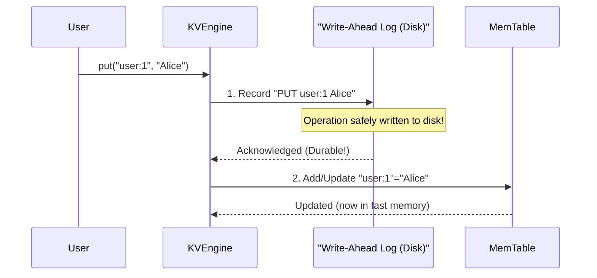
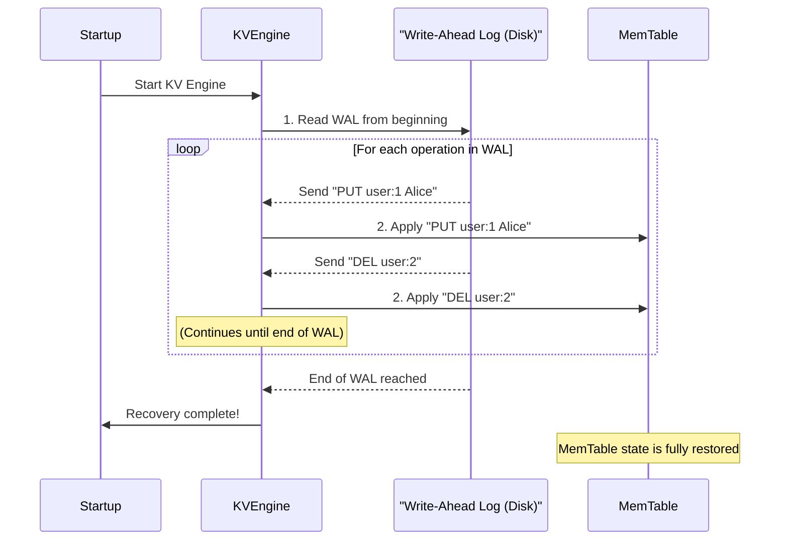

# Chapter 4: Write-Ahead Log (WAL)

In the [previous chapter](03_data_segment.md), we explored **Data Segments (SSTables)**, which provide a way to store our `purekv` data permanently on disk. While Data Segments are great for long-term storage and the [MemTable](02_memtable.md) provides speed, there's still a critical question: What happens if your computer suddenly loses power or the `purekv` program crashes _right in the middle_ of saving or updating data?

Without a special mechanism, any changes that were in the fast [MemTable](02_memtable.md) but not yet flushed to a Data Segment, or even changes being written to a Data Segment, could be lost forever! This is where the **Write-Ahead Log (WAL)** comes to the rescue.

## What is the Write-Ahead Log (WAL)?

The Write-Ahead Log (WAL) is a simple but incredibly powerful concept for ensuring that your data is **durable** and can be **recovered** after any crash.

Imagine a bank. Every time a customer makes a deposit, withdrawal, or transfer, the bank doesn't immediately update the account balances on a physical ledger. Instead, a diligent clerk first writes down _every single transaction_ in a special, sequential transaction log. Only _after_ the transaction is recorded in this log does the bank proceed to update the actual account balances.

The WAL in `purekv` works exactly like this bank ledger:

- **"Write-Ahead"**: Before `purekv` makes _any_ change to its in-memory data (like updating the [MemTable](02_memtable.md)), it first writes a record of that operation to a special log file on disk. This disk write happens _ahead_ of the actual data modification.
- **Log**: This file is a simple, sequential record of every `put` and `del` operation. New operations are just added to the end.

This "log first" approach is the cornerstone of data safety in `purekv`.

## Why is the WAL Critical? (Durability and Recovery)

The WAL primarily solves two big problems:

1.  **Durability**: Once an operation is written to the WAL on disk, it is considered "durable." Even if `purekv` crashes immediately after this write, we know the operation won't be lost because it's safely stored on disk.
2.  **Crash Recovery**: If `purekv` restarts after a crash, it doesn't try to guess what happened. Instead, it simply "replays" all the operations from the WAL file, in order, from beginning to end. By reapplying these operations, `purekv` can reconstruct its in-memory state (the [MemTable](02_memtable.md)) exactly as it was before the crash, preventing any data loss.

## How the WAL Works in `purekv`

Let's look at how the WAL fits into the `put` and `del` operations, and how it's used during startup.

### 1. `put` and `del` Operations (Logging First)

When you call `put(key, value)` or `del(key)`, the `purekv` **[KV Engine](01_kv_engine_.md)** performs a critical first step involving the WAL.

Here’s the simplified flow for a `put` operation:



As you can see, the operation is written to the WAL _before_ the [MemTable](02_memtable.md) is updated. This ensures that even if the system crashes between step 1 and step 2, the `PUT user:1 Alice` record is on disk, allowing recovery. A `del` operation follows the exact same "log first" principle.

### 2. Startup and Crash Recovery (Replaying the Log)

This is where the magic of the WAL truly shines. When `purekv` starts up, especially after an unexpected shutdown, it needs to get back to a consistent state.



During recovery, the [KV Engine](01_kv_engine_.md) reads every operation from the WAL file, one by one, and reapplies them to its in-memory [MemTable](02_memtable.md). This brings the [MemTable](02_memtable.md) back to the state it was in _just before_ any potential crash, guaranteeing data integrity.

## WAL in `purekv` Code

Let's look at the actual `purekv` code to see how the WAL is implemented and used.

### WAL Record Structure

Each record in the WAL file has a consistent structure. It includes a checksum for integrity, the type of operation (PUT or DEL), lengths of the key and value, and then the actual key and value data.

```
| uint32 checksum | (Checksum for data integrity)
| uint8  type     | (1 = PUT, 2 = DEL)
| uint32 key_len  | (Length of the key in bytes)
| uint32 val_len  | (Length of the value in bytes)
| key bytes       | (The actual key data)
| value bytes     | (The actual value data, only for PUT operations)
```

The `checksum` is calculated for the `type`, `key_len`, `val_len`, `key bytes`, and `value bytes`. When `purekv` reads a record, it recalculates the checksum and compares it. If they don't match, it means the record is corrupted, and `purekv` will stop replaying from that point.

### `include/wal.h`: WAL Interface

The `wal.h` file defines the interface for the `WAL` class, including methods to append PUT/DEL operations and to replay the log.

```cpp
// From include/wal.h
enum class WalOpType {
    PUT, // Represents a 'put' operation
    DEL  // Represents a 'delete' operation
};

class WAL{
    public:
        virtual ~WAL() = default;

        // Records a 'put' operation to the WAL
        virtual Status appendPut(const string &key ,const string & value) = 0;
        // Records a 'delete' operation to the WAL
        virtual Status appendDel(const string &key) = 0;
        // Ensures all buffered writes are flushed to disk
        virtual Status sync() = 0;
        // Replays the entire WAL, calling 'fn' for each operation
        virtual Status replay(
            const function<void(WalOpType,const string& ,const string&) >& fn
        ) = 0;
};

// Factory method to create a WAL instance
WAL* CreateWAL(const string &path);
```

`appendPut` and `appendDel` are used to write new operations. `replay` is the method called during startup to reconstruct the state.

### `src/wal.cpp`: Appending to the WAL

The `append` helper function (called by `appendPut` and `appendDel`) is responsible for formatting and writing records to the WAL file.

```cpp
// From src/wal.cpp (simplified append method)
class WALImpl:public WAL{
    private:
        int fd_; // File descriptor for the WAL file
        mutex mu_; // Protects concurrent writes to the WAL

        Status append(uint8_t type, const string &key, const string &value){
            lock_guard<mutex> lock(mu_); // Ensure only one write at a time

            // Calculate lengths of key and value
            uint32_t klen = key.size();
            uint32_t vlen = value.size();

            // Create a buffer for type, lengths, key, and value
            vector<char>buf; // ... resize and fill buf ...

            // Calculate checksum (CRC)
            uint32_t crc = crc32(0, reinterpret_cast<const Bytef *>(buf.data()), buf.size());

            // 1. Write the checksum to the file
            write(fd_, &crc, 4);
            // 2. Write the rest of the record (type, lengths, key, value)
            write(fd_, buf.data(), buf.size());

            // IMPORTANT: Force write to physical disk (ensure durability)
            fsync(fd_);
            return Status::OK();
        }
    // ... rest of WALImpl ...
};
```

The key steps here are writing the `crc` and the `buf` (which contains the operation details) to the file descriptor `fd_`, followed by `fsync(fd_)`. The `fsync` call is crucial; it tells the operating system to immediately flush any buffered data for this file to the actual physical disk, guaranteeing durability.

### `src/wal.cpp`: Replaying the WAL

The `replay` method reads the WAL file from the beginning and uses a callback function (`fn`) to apply each operation.

```cpp
// From src/wal.cpp (simplified replay method)
class WALImpl:public WAL{
    // ... private members and append method ...
    public:
        Status replay(const function<void(WalOpType, const string&, const string&)>& fn) override {
            int rfd = open(path_.c_str(), O_RDONLY); // Open WAL for reading
            if (rfd < 0) return Status::OK(); // File might not exist yet

            while(true){ // Loop to read records until EOF or error
                uint32_t stored_crc =0;
                ssize_t n= read(rfd, &stored_crc, 4); // Read stored CRC
                if(n==0) break; // End of file
                if(n!=4) break; // Partial read, file likely corrupted

                uint8_t type;
                uint32_t klen, vlen;
                // Read type, key_len, val_len ...

                vector<char>buf; // ... resize and read rest of record into buf ...

                uint32_t calc_crc = crc32(0, reinterpret_cast<const Bytef *>(buf.data()), buf.size());

                if(calc_crc != stored_crc){
                    break; // CRC mismatch: record is corrupted, stop replaying
                }

                // Extract key and value from buf
                string key(buf.data() + 9, klen);
                string value;
                // ... populate value if type is REC_PUT ...

                // Call the provided function 'fn' to apply the operation
                if(type == REC_PUT){
                    fn(WalOpType::PUT, key, value);
                } else if(type == REC_DEL){
                    fn(WalOpType::DEL, key, "");
                }
            }
            close(rfd);
            return Status::OK();
        }
    // ... rest of WALImpl ...
};
```

The `replay` method diligently reads each record, checks its integrity using the CRC, and then passes the operation type, key, and value to the `fn` callback. This `fn` is provided by the `KVEngine` during startup.

### `src/kv_engine.cpp`: Using the WAL

Let's see how the [KV Engine](01_kv_engine_.md) integrates the WAL.

#### KV Engine Constructor (Recovery)

When the `KVEngineImpl` object is created (i.e., when `purekv` starts up), it immediately calls `wal_->replay()` to recover its state.

```cpp
// From src/kv_engine.cpp (KVEngineImpl constructor)
class KVEngineImpl : public KVEngine {
    private:
        unordered_map<string, string> store_; // Our MemTable
        // ... other components ...
        WAL* wal_; // Pointer to our WAL instance

    public:
        KVEngineImpl() :wal_(CreateWAL("wal/kv.wal")){
            // Call WAL's replay method
            wal_->replay(
                [this](WalOpType type, const string &key, const string &value){
                    unique_lock<shared_mutex>lock(mem_mu_); // Protect MemTable
                    if(type==WalOpType::PUT){
                        store_[key]=value; // Re-apply PUT to MemTable
                    } else if(type==WalOpType::DEL){
                        store_.erase(key); // Re-apply DEL to MemTable
                    }
                }
            );
        }
        // ... rest of the KVEngineImpl class ...
};
```

The lambda function passed to `replay` tells the `KVEngine` exactly what to do with each recovered operation: for a `PUT`, it adds/updates the key in the `store_` ([MemTable](02_memtable.md)); for a `DEL`, it removes it from `store_`. This effectively rebuilds the [MemTable](02_memtable.md) from the WAL.

#### `put` Method (Logging First)

The `put` method in `KVEngineImpl` clearly demonstrates the "Write-Ahead" principle.

```cpp
// From src/kv_engine.cpp (KVEngineImpl::put)
Status put(const string & key,const string & value) override{
    {
        lock_guard<mutex> wlock(wal_mu_); // Protect WAL operations
        wal_->appendPut(key, value); // 1. Write to WAL first!
    }
    {
        unique_lock<shared_mutex>mlock(mem_mu_); // Protect MemTable
        store_[key]=value; // 2. Then update the in-memory MemTable
    }

    // ... (logic for checking MemTable size and flushing) ...

    return Status::OK();
}
```

Notice how `wal_->appendPut(key, value);` happens _before_ `store_[key]=value;`. This order is fundamental for durability.

#### `del` Method (Logging First)

Similarly, the `del` method also ensures the operation is logged first.

```cpp
// From src/kv_engine.cpp (KVEngineImpl::del)
Status del(const string & key) override{
    {
        lock_guard<mutex> wlock(wal_mu_); // Protect WAL operations
        wal_->appendDel(key); // 1. Record deletion in WAL first!
    }
    {
        unique_lock<shared_mutex>lock(mem_mu_); // Protect MemTable
        auto it=store_.find(key);
        if(it==store_.end()){
            return Status::Error("KEY_NOT_FOUND");
        }
        store_.erase(key); // 2. Then remove from in-memory MemTable
    }
    return Status::OK();
}
```

Again, `wal_->appendDel(key);` is executed before `store_.erase(key);`, making the deletion durable before it's applied to the in-memory store.

## Key Characteristics of WAL

| Feature              | Description                                        | Impact                                                        |
| :------------------- | :------------------------------------------------- | :------------------------------------------------------------ |
| **Disk-Based**       | Stored in a file on disk.                          | **Durable**: Operations survive crashes.                      |
| **Sequential Write** | New operations are always appended to the end.     | **Extremely Fast Writes**: Disk optimizes sequential writes.  |
| **Immutable**        | Once written, records are not changed.             | Simpler to manage; good for concurrent access.                |
| **For Recovery**     | Used to rebuild the in-memory state after a crash. | **Reliable**: Prevents data loss during unexpected shutdowns. |

## Conclusion

The Write-Ahead Log (WAL) is the unsung hero of `purekv`'s reliability. By strictly enforcing the "log first" rule, it guarantees that every `put` and `del` operation becomes durable the moment it's written to disk, long before any in-memory or slower disk structures are updated. This simple yet powerful mechanism ensures that even in the face of sudden crashes, `purekv` can always recover to a consistent and correct state by replaying its transaction ledger.

Now that we understand how `purekv` stores data safely and persistently, we've built up quite a few [Data Segment](03_data_segment.md) files and maybe some redundant data. In the next chapter, we'll learn about **Compaction**, the process that cleans up these files and keeps our database efficient.

[Next Chapter: Compaction](05_compaction.md)

---
