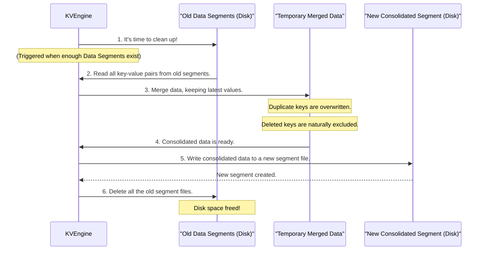

# Chapter 5: Compaction

In the [previous chapter](04_write_ahead_log.md), we learned about the **Write-Ahead Log (WAL)**, which ensures our `purekv` operations are durable and can be recovered after a crash. We also know that new data is first buffered in the super-fast [MemTable](02_memtable.md) and then "flushed" to permanent storage in **[Data Segment](03_data_segment.md)** files on disk.

However, the way [Data Segments](03_data_segment.md) work—being immutable (unchangeable) and always created new—creates a new challenge:

## The Problem: Messy Data and Slow Reads

Imagine your office has a physical filing cabinet. Every time you update a document or create a new one, you don't overwrite the old one; you simply print a new version and add it to the cabinet. If you also "delete" a document, you might just throw it in the recycling bin, but its older copy could still be in the cabinet.

Over time, this filing cabinet would become:

1.  **Cluttered with Duplicates**: Multiple versions of the same document, making it hard to find the "latest" one.
2.  **Full of Obsolete Files**: Documents you've "deleted" might still be physically present, taking up space.
3.  **Slow to Search**: You have to sift through many files, including old and irrelevant ones, just to find what you need.

This is exactly what happens with `purekv`'s [Data Segment](03_data_segment.md) files:

- When you `put("user:1", "Alice")` then `put("user:1", "Bob")`, "Alice" remains in an older segment, and "Bob" goes into a newer one.
- When you `del("user:1")`, the key is removed from the [MemTable](02_memtable.md) and recorded in the [WAL](04_write_ahead_log.md), but it might still exist in many old [Data Segment](03_data_segment.md) files.

To solve this problem of accumulating old, duplicate, and deleted data, `purekv` uses a background process called **Compaction**.

## What is Compaction?

**Compaction is `purekv`'s way of tidying up the database's disk storage.**

It's a background process that takes several older [Data Segment](03_data_segment.md) files, merges their contents, and writes them into a _single, new, clean_ [Data Segment](03_data_segment.md) file.

During compaction:

- **Duplicate keys are resolved**: If "user:1" appears multiple times across different segments, only the _latest_ version ("Bob" in our example) is kept in the new consolidated segment.
- **Deleted keys are removed**: Any keys that were deleted (meaning they don't appear in the latest versions of data) are completely omitted from the new segment. This truly frees up the disk space they once occupied.
- **Disk space is reclaimed**: By removing old versions and deleted keys, compaction reduces the overall storage footprint.
- **Read performance improves**: With fewer, consolidated segments, `purekv` has fewer files to search when performing a `get` operation, making reads faster.

Think of it as periodically reorganizing your messy filing cabinet: shredding old redundant documents, removing duplicates, and filing the remaining, up-to-date papers into a single, cleaner folder.

## How Compaction Works in `purekv` (High-Level)

Compaction in `purekv` is triggered automatically by the [KV Engine](01_kv_engine_.md) when a certain number of [Data Segment](03_data_segment.md) files have accumulated.

Here's a simplified sequence of events:



Let's break down these steps in more detail:

1.  **Trigger**: The [KV Engine](01_kv_engine_.md) monitors how many [Data Segment](03_data_segment.md) files are on disk. Once this count reaches a specific `compaction_threshold`, the compaction process begins.
2.  **Gather Old Segments**: `purekv` identifies all existing [Data Segment](03_data_segment.md) files.
3.  **Merge Data**: It then reads through all these old segments, one by one, typically starting from the oldest to the newest. As it reads, it collects all key-value pairs into a temporary in-memory structure (like an `unordered_map`). Because newer segments contain the most up-to-date values, adding a key from a newer segment will automatically overwrite an older value for the same key already present in the temporary map. Keys that were deleted (meaning they simply don't appear in the latest data added to the system) will not be copied into this map.
4.  **Create New Segment**: Once all old segments have been processed and merged, the temporary map now holds a clean, de-duplicated, and up-to-date set of all active key-value pairs. This data is then written out to a _brand new_ [Data Segment](03_data_segment.md) file on disk.
5.  **Delete Old Segments**: Finally, all the original, old [Data Segment](03_data_segment.md) files that were part of the merge are deleted from the disk, freeing up storage space. The `purekv` system then updates its internal list to only include the new, consolidated segment.

## Compaction in `purekv` Code

Let's look at the relevant parts of `src/kv_engine.cpp` to see how compaction is implemented.

### Compaction Threshold

The `KVEngineImpl` class has a `compaction_threshold` member, which defines how many segments need to exist before compaction is triggered.

```cpp
// From src/kv_engine.cpp
class KVEngineImpl : public KVEngine {
    private:
        // ...
        vector<string> segments_; // Our list of Data Segment filenames
        size_t compaction_threshold = 3; // Trigger compaction after 3 segments
        // ...
};
```

In our simple `purekv` implementation, `compaction_threshold` is set to 3. This means that after three [Data Segment](03_data_segment.md) files have been created, `purekv` will initiate a compaction.

### Triggering Compaction

Compaction is triggered within the `flush_memtable()` function, right after a new [Data Segment](03_data_segment.md) has been created.

```cpp
// From src/kv_engine.cpp (inside flush_memtable())
void flush_memtable(){
    // ... (Code to snapshot MemTable and write new segment omitted) ...

    // After adding the new segment, check if it's time to compact
    if(segments_.size()>=compaction_threshold){
        compact_segments(); // Call the compaction function
    }
}
```

This check ensures that compaction happens periodically as data accumulates on disk.

### The `compact_segments` Function

The `compact_segments` function contains the core logic for the compaction process.

```cpp
// From src/kv_engine.cpp
void  compact_segments(){
    vector<string>local_segments;
    {
        lock_guard<mutex> lock(seg_mu_);
        // 1. Take all current segment names to process
        local_segments.swap(segments_);
    }

    unordered_map<string, string> merged;
    // 2. Read data from all old segments into a temporary map
    for(const auto &seg: local_segments){
        // 'read_segment' reads all key-value pairs from a segment
        // and adds them to the 'merged' map.
        // If a key already exists, its value is overwritten (keeping the latest).
        read_segment(seg,merged);
    }

    ostringstream name;
    // 3. Create a name for the new consolidated segment file
    name << "segments/seg_"<<segments_.size()<<".sst";

    // 4. Write the merged, clean data to the new segment file
    write_segment(name.str(), merged);

    {
        lock_guard<mutex> lock(seg_mu_);
        // 5. Delete all the old segment files from disk
        for(const auto &seg: local_segments){
            unlink(seg.c_str());
        }
        // 6. Clear the list of segments and add the new consolidated one
        segments_.clear();
        segments_.push_back(name.str());
    }
}
```

Let's break down the important lines:

1.  `local_segments.swap(segments_);`: This line is clever. It atomically moves all the current [Data Segment](03_data_segment.md) filenames from `segments_` into `local_segments`, and at the same time, clears `segments_`. This means the `KVEngine` will temporarily have no segments to search during `get` operations (though it still relies on the [MemTable](02_memtable.md) and the new segment will be added soon).
2.  `for(const auto &seg: local_segments){ read_segment(seg,merged); }`: This loop is the heart of the merge. `read_segment` (which iterates through a segment file and adds all its key-value pairs to the `merged` `unordered_map`) is called for each old segment. Because `unordered_map` naturally handles unique keys, if a key is found in a newer segment, it overwrites the older value in `merged`. Keys that were deleted will not be present in `merged` if their last known state was a deletion (or simply not existing in any active segments).
3.  `write_segment(name.str(), merged);`: After all old data is consolidated in `merged`, it's written out to a brand-new [Data Segment](03_data_segment.md) file.
4.  `unlink(seg.c_str());`: This is the crucial step that removes the old, redundant [Data Segment](03_data_segment.md) files from your disk, reclaiming storage space.
5.  `segments_.clear(); segments_.push_back(name.str());`: Finally, the `segments_` list is updated to reflect that all the old segments are gone, and only the new, clean, consolidated segment exists.

## Benefits of Compaction

| Benefit              | Description                                                                       | Impact                                                  |
| :------------------- | :-------------------------------------------------------------------------------- | :------------------------------------------------------ |
| **Disk Space**       | Removes old versions of data and truly deleted items.                             | Reduces storage footprint, keeps disk usage in check.   |
| **Read Performance** | Fewer [Data Segment](03_data_segment.md) files to search during `get` operations. | Faster data retrieval, especially for older data.       |
| **Data Consistency** | Ensures only the latest version of any key is retained.                           | Prevents confusion from outdated data.                  |
| **Reduced I/O**      | Although compaction itself involves I/O, it reduces subsequent `get` I/O.         | Overall more efficient use of disk resources over time. |

## Conclusion

Compaction is an essential background process that keeps `purekv`'s disk storage clean, efficient, and performant. By regularly merging and consolidating [Data Segment](03_data_segment.md) files, it addresses the challenges introduced by immutable files: reclaiming disk space, removing obsolete data, and ensuring that lookups are as fast as possible. It's a critical part of how `purekv` maintains a healthy and responsive database over time.

This concludes our journey through the core components of the `purekv` Key-Value Engine! We've seen how the [KV Engine](01_kv_engine_.md) coordinates the [MemTable](02_memtable.md) for speed, [Data Segments](03_data_segment.md) for persistence, the [Write-Ahead Log (WAL)](04_write_ahead_log.md) for durability, and Compaction for efficiency. You now have a solid understanding of the fundamental building blocks of a simple, yet robust, Key-Value database.
