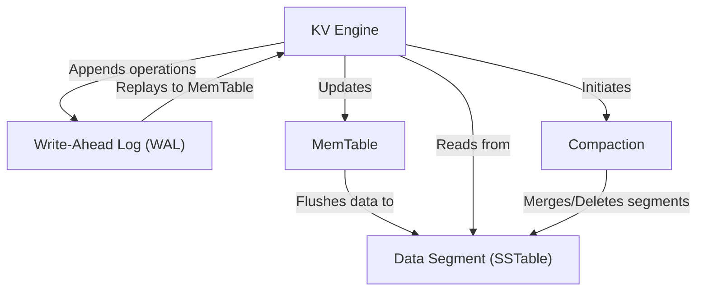

# Tutorial: **purekv**

`purekv` is a **simple** but **robust** _key-value store database_. It efficiently handles `put`, `get`, and `del` operations by first recording them in a _Write-Ahead Log_ for crash recovery, then storing them in a _fast in-memory table_. Periodically, this in-memory data is saved to _immutable disk files_, which are later _optimized_ through a background process to maintain performance.

## Visual Overview

## Chapters

1. [KV Engine
   ](01_kv_engine)
2. [MemTable
   ](02_memtable)
3. [Data Segment (SSTable)
   ](03_data_segment)
4. [Write-Ahead Log (WAL)
   ](04_write_ahead_log)
5. [Compaction
   ](05_compaction)

---
